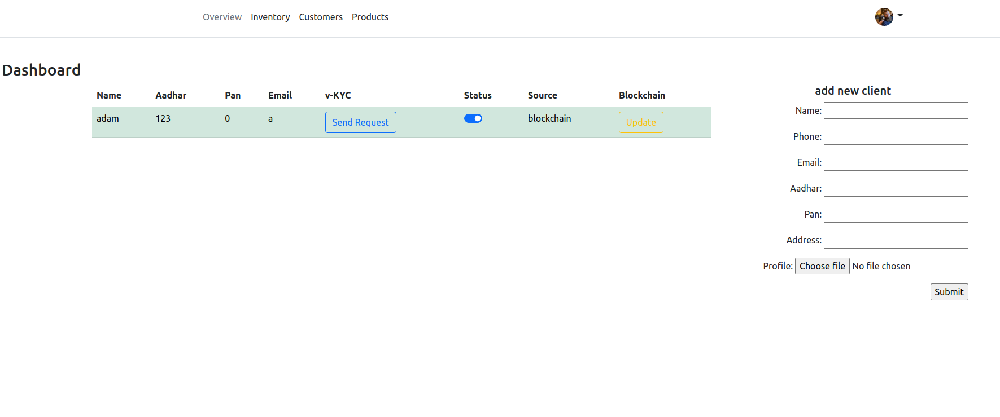

[]()
[]()
[]()
#   Eth-Box 

---
**A Blockchain-Based Solution For Efficient And Secure Video-KYC**

## How to start locally
  *if you want to run the blockchain in real Ethereum network else you can run a local blockchain using Ganache and skip the Infura setup.*
  
### Infura Setup 
- Go to [infura](https://infura.io/) and create a new project, this will give you an endpoint by which you can connect with Ethereum network. 
- Create a wallet and encrypt the wallet using password. [Tutorial](https://youtu.be/SAi5rYFh7yw)
- Save the infura endpoint and password in `secret.json` file like below:
```JSON
{
    "url": "infura-end-point-url",
    "pass":"wallet-password",
    "contract_address": "deployed-contract-address"
}
```
- Save the wallet with name of `wallet.json`

### Ganache Setup
- Download the Ganache software and install. [Download](https://trufflesuite.com/ganache/)
- Switch to Ganache branch
``` bash 
git checkout ganache
```

### Run Web Server 
- Install all requirements 
```bash 
pip install -r requirements.txt
```
- Run the django server 
```bash
python3 manage.py runserver
```

### App
Landing page


<br>

Dashboard


<br>

Client Login


<br>

Admin page


<br>

Admin login
